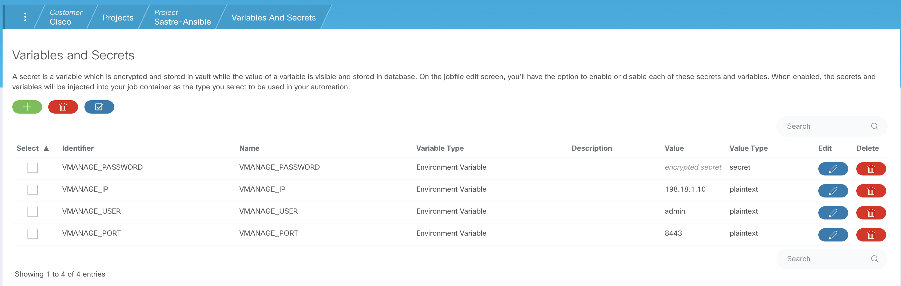
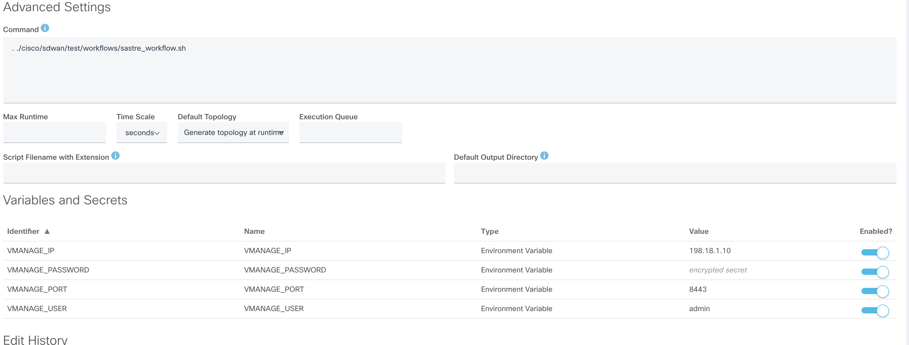

# Cisco SDWAN workflows automation

Cisco SDWAN Test Workflows will automate and test some of the Sastre-Ansible module tasks end to end. 

These workflows will leverage [CXTA framework](https://wwwin-github.cisco.com/AS-Community/CXTA) for building and running workflows

## CXTA version compatibility

These workflows are tested against following CXTA versions: **==21.9**.

## Running the workflows in Docker

* Launch [CXTA docker container](https://engci-maven.cisco.com/artifactory/list/cxta-docker/cxta/21.9/)
* Copy **workflows** folder inside docker container
* Run docker (ex : docker run -it dockerhub.cisco.com/cxta-docker/cxta:21.9 bash)
* Inside Docker Container 
  * Install softwares listed in Dependency section 
  * update and source **env.sh**
  * Run cisco sdwan workflow 
    * cd to **workflows** folder
    * cxta sastre_workflows.robot  
  * Check **report.html** for test report statistics
  * Check **log.html** for test logs  

## Running the workflows in CXTM UI
* create a Project
  * configure GIT 
  * Configure VPN (if SDWAN dcloud instance is used)
* At project level , configure following 4 variables in "Variables and Secrets" section
  * VMANAGE_IP
  * VMANAGE_PORT
  * VMANAGE_USER
  * VMANAGE_PASSWORD (select as secret)
* 
* Create a jbofile 
  * Enter job file name
  * Select jobfile type as "Script in GIT repo"
  * Select Runtime Image Type as "cxta"
  * Add this command in the "command" text box under Advanced Settings section
    * . ./cisco/sdwan/test/workflows/sastre_workflow.sh
  *  
  * Click "Save and Run" to run the script

## Dependency

* Install [Sastre-Pro](https://wwwin-github.cisco.com/AIDE/Sastre-Pro) using pip
* Install [Sastre-Ansible](https://wwwin-github.cisco.com/AIDE/Sastre-Ansible) refer [ReadMe](https://wwwin-github.cisco.com/AIDE/Sastre-Ansible/blob/master/README.md) for build and installation